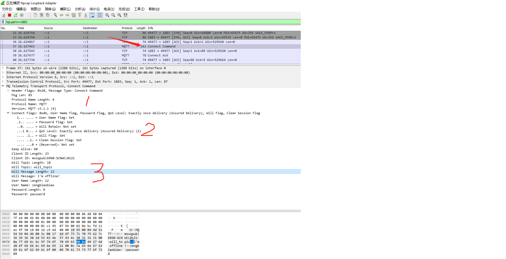

# MQTT 协议 -- Connect

### 概述

今天来学习MQTT协议中关于connect部分，connect是很重要的部分，因为它是Client 与MQTT Broker通信的基础，并且提供了很多很有用的特性，很多场景中都可以用到这些特性。

还是理论结合着实践来讲吧，否则担心小伙伴们看了睡觉。~~~

前面已经讲过了，MQTT是一种基于发布订阅的消息传输协议，所以MQTT发布客户端可以发布消息到1个或多个订阅客户端。这个模式很像电视或者收音机的广播，电台发布节目，千家万户的观众接收节目。所有的消息都是发给MQTT Broker，MQTT Broker再将消息转发给它的订阅者。在这个过程中，需要注意以下几点：

- 所有客户端都有一个唯一Id，这个Id只是一个标记，不是客户地址。发布端发布消息时，只能发给某个topic，而不能将消息发给某个地址或Id。
- 客户端的Id不能重复。如果有一个客户端Client A连到MQTT Broker，如果之后又有一个客户端Client B连到MQTT Broker，此时MQTT Broker会断开Client A的连接。因为MQTT 客户端有自动连接功能，Client A断开连接之后，尝试重新连接到MQTT Broker，此时Client B又会断开，之后Client B又进行重连，然后两个Client就会进入断开-连接-断开的死循环。
- MQTT Broker负责接收消息，并进行过滤，将消息转发给订阅了相关主题的Client。
- Publisher和Subscriber没有直接的关联。他们都只与MQTT Broker进行连接。
- 客户端既可以发送消息，也可以接收消息。
- 通常情况下，MQTT Broker是不存储消息的。

现在应该对MQTT Client和Broker有一个比较清楚的认识了。我们来讨论MQTT Connect的格式吧。

---

### CONNECT

##### Fixed Header

MQTT的固定头部包含了首字节和可变长度。其中首字节的高4位(bit7~bit4)用于表示报文类型，1表示connect。其它标记字节(bit3~bit0)都为0，如下表。

| Bit       | 7         | 6      | 5    | 4    | 3    | 2    | 1    | 0    |
| --------- | --------- | ------ | ---- | ---- | ---- | ---- | ---- | ---- |
| Byte 1    | 0         | 0      | 0    | 1    | 0    | 0    | 0    | 0    |
| Byte 2... | Remaining | Length |      |      |      |      |      |      |

##### Variable Header

在Connect报文中，可变头部包含10个字节，如下表：

| Byte    | Description    | bit7      | bit6     | bit5        | bi4      | bit3     | bit2      | bit1          | bit0     |
| ------- | -------------- | --------- | -------- | ----------- | -------- | -------- | --------- | ------------- | -------- |
| Byte 1  | Length MSB (0) | 0         | 0        | 0           | 0        | 0        | 0         | 0             | 0        |
| Byte 2  | Length LSB (4) | 0         | 0        | 0           | 0        | 0        | 1         | 0             | 0        |
| Byte 3  | 'M'            | 0         | 1        | 0           | 0        | 1        | 1         | 0             | 1        |
| Byte 4  | 'Q'            | 0         | 1        | 0           | 1        | 0        | 0         | 0             | 1        |
| Byte 5  | 'T'            | 0         | 1        | 0           | 1        | 0        | 1         | 0             | 0        |
| Byte 6  | 'T'            | 0         | 1        | 0           | 1        | 0        | 1         | 0             | 0        |
| Byte 7  | Level(4)       | 0         | 0        | 0           | 0        | 0        | 1         | 0             | 0        |
| Byte 8  | Connect Flag   | User Name | Password | Will Retain | Will QoS | Will QoS | Will Flag | Clean Session | Reserved |
| Byte 9  | Keep Alive MSB | 0         | 0        | 0           | 0        | 0        | 0         | 0             | 0        |
| Byte 10 | Keep Alive MSB | 0         | 1        | 1           | 0        | 0        | 0         | 0             | 0        |

可变头部的内容包含Protocol Name, Protocol Level, Connect Flags以及Keep Alive时间。下面分别介绍：

**Protocol Name:** 字节1-6，这部分内容是固定的，其中字节1和字节2表示协议名称长度，其内容是0x04。字节3-字节6表示协议名称"MQTT"的UTF-8编码。

**Protocol Level:** 字节7，表示协议等级，MQTT 3.1.1协议版本的协议等级是4。

**Connect Flag:** 字节8，连接标记，每一位都表示一个标记，Bit0是保留标记。从Bit1~Bit7，分别表示Clean Session, Will Flag等内容。这些标记确定了Payload是否包含对应的信息。例如，如果Bit7和Bit6的值都为1，那么表示此次连接的Payload中包含User Name和Password。后边会分别介绍各个标记的作用。

**Keep Alive:** 字节9和字节10，客户端与服务器心跳间隔，高字节在前，低字节在后。单位是S，默认是60S。关于Keep Alive，需要注意的事项包括：

- 当客户端和服务器之间没有消息传输时，客户端会每隔60S(keep alive值)向MQTT Broker发送PINGREQ数据报文。服务器需要回复PINGRESP数据报文。
- 如果客户端在发送PINGREQ数据包一段时间后没有收到PINGRESP数据包，客户端会断开连接。
- 如果Keep Alive的值设置为大于0(假设60S)，在没有数据交互的情况下，服务器如果在超过1.5倍Keep Alive时间(90S)后没有收到PINGREQ数据包，则服务器会断开与当前客户端的连接。
- Keep Alive可以设置为0，那么客户端不会发送PINGREQ数据包，服务器也不会因为没有收到PINGREQ而断开客户端连接。

我们来测试一下Keep Alive，观察PINGREQ和PINGRESP数据包。在命令行终端输入以下命令，会得到相应结果：

```bash
$ mosquitto_sub -t topic001 -k 5 -d
Client mosqsub|16532-SCNWCL012 sending CONNECT
Client mosqsub|16532-SCNWCL012 received CONNACK (0)
Client mosqsub|16532-SCNWCL012 sending SUBSCRIBE (Mid: 1, Topic: topic001, QoS: 0)
Client mosqsub|16532-SCNWCL012 received SUBACK
Subscribed (mid: 1): 0
Client mosqsub|16532-SCNWCL012 sending PINGREQ
Client mosqsub|16532-SCNWCL012 received PINGRESP
Client mosqsub|16532-SCNWCL012 sending PINGREQ
Client mosqsub|16532-SCNWCL012 received PINGRESP
Client mosqsub|16532-SCNWCL012 sending PINGREQ
Client mosqsub|16532-SCNWCL012 received PINGRESP
```

上面命令中，-t topic001表示订阅topic为topic001的主题，使用 -k 5表示设置keep alive时间间隔为5S，-d表示启用Debug模式。从输出结果可以看到每隔5S，客户端会发送PINGREQ，并收到从服务器返回的PINGRESP。

##### Connect Flag

因为Connect Flag的内容比较多，所以单独用一小节来介绍。

###### Reserved

第8字节的Bit0。保留位，必须为0。

###### Clean Session

第8字节的Bit1，用于表示是否需要清除Session，如果值为0，表示保留Session，如果为1，表示清除Session。

Client和Broker可以存储一些Session状态信息，用于消息的可靠传输。我们知道MQTT是通过定义QoS等级来保证消息的可靠传输的，所以Session状态信息中最重要的就是QoS消息的状态。以Broker为例，对于QoS为1或者2的消息，如果Broker无法成功投递消息到Client A，那么消息状态会保留下来，当下次Client A重新连接时，服务器会根据Session状态，重新投递之前失败的消息。

**所以，如果客户端发布或订阅某个topic，并且设置了QoS > 0，那么Clean Session必须设置为0。**

###### Will Flag

第8字节的Bit2，用于标记是否发送遗愿消息。

遗愿消息是指当客户端非正常断开时，客户端希望发送一条消息给一个指定的topic，通知对方自己掉线了。遗愿消息的一个应用场景是设备掉线提醒，当设备掉线后，订阅方(通常是后台服务器)就知道设备已经掉线了。

当Will Flag设置为1时，表示需要设置遗愿消息，那么Broker会存储遗愿消息并且在客户端异常掉线之后，发送遗愿消息到指定的topic。

如果Will Flag设置为1，那么必须要有Will Topic(遗愿主题)和Will Message(遗愿消息)，并且Will QoS和Will Retain也会被读取。遗愿消息也可以设置QoS的，这样可以确保遗愿消息的可靠传递。

那么什么情况下Broker会发送Will Message呢？当以下任何一种情况发生时，Broker会发送遗愿消息。

- 网络异常
- 服务器在Keep Alive超时后没有收到PINGREQ
- 客户端在关闭连接之前，没有先发送DISCONNECT
- 服务器因为协议错误关闭客户端连接

**需要注意的是，如果客户端正常关闭连接，在关闭连接之前发送了DISCONNECT，遗愿消息是不会被发送的。当客户端发送DISCONNECT请求后，遗愿消息会被Broker删除。**

###### Will QoS

第8字节的Bit3和Bit4，用来设置遗愿消息的QoS，因为QoS有3个值，0,1和2，所以用两位来表示，高位在前，低位在后。

###### Will Retain

第8字节的Bit5，用于标记是否保留遗愿消息。

Will Retain这个标记也很有用，如果设置成1，当客户端掉线后，之后所有新的订阅者订阅Will Topic时，都能收到遗愿消息。QoS > 0只能报纸之前订阅过的订阅者收到消息，Will Retain能确保新的订阅者也接收到消息。

###### User Name Flag

用于标记Payload中是否包含User Name信息。如果设置成1，payload中必须包含User Name信息。

###### Password Flag

用于标记Payload中是否包含Password信息。如果设置成1，payload中必须包含Password信息。需要注意的是，如果User Name Flag设置成0，Password Flag必须设置成0。但是可以只包含用户名，不包含密码，所以User Name Flag设置成1时，Password Flag也可以设置成0.

##### Keep Alive

可变头中第9和第10字节用来表示Keep Alive时间。这个时间是MQTT的心跳时间，单位是秒，默认值是60S。在Client和Broker没有数据交互的情况下，Client需要发送PINGREQ给Broker，Broker回复PINGRESP，用于检测客户端是否在线。关于Keep Alive，需要注意一下几点：

- 客户端负责发送心跳PINGREQ，服务端只管在接收到心跳时回复PINGRESP。
- 客户端在发送PINGREQ一段时间后，未收到回复，客户端将关闭连接。
- 服务端在Keep Alive的1.5被时间之后，没有收到客户端的任何数据，包括PINGREQ，也会关闭连接。
- Keep Alive可以设置为0，表示不启用心跳机制，那么客户端，服务器都不会因为未收到心跳或回复而关闭连接。

##### 示例

我们来看一个CONNECT报文的可变头的例子，加深理解。

|        | 描述             | 7    | 6    | 5    | 4    | 3    | 2    | 1    | 0    |
| ------ | ---------------- | ---- | ---- | ---- | ---- | ---- | ---- | ---- | ---- |
| 协     | 议               | 类   | 型   |      |      |      |      |      |      |
| 字节1  | 类型长度高位 (0) | 0    | 0    | 0    | 0    | 0    | 0    | 0    | 0    |
| 字节2  | 类型长度低位 (4) | 0    | 0    | 0    | 0    | 0    | 1    | 0    | 0    |
| 字节3  | 'M'              | 0    | 1    | 0    | 0    | 1    | 1    | 0    | 1    |
| 字节4  | 'Q'              | 0    | 1    | 0    | 1    | 0    | 0    | 0    | 1    |
| 字节5  | 'T'              | 0    | 1    | 0    | 1    | 0    | 1    | 0    | 0    |
| 字节6  | 'T'              | 0    | 1    | 0    | 1    | 0    | 1    | 0    | 0    |
| 协     | 议               | 等   | 级   |      |      |      |      |      |      |
| 字7    | Level (4)        |      |      |      |      |      |      |      |      |
| 连     | 接               | 标   | 记   |      |      |      |      |      |      |
| 字节8  | 见备注           | 1    | 1    | 0    | 0    | 1    | 1    | 0    | 0    |
| Keep   | Alive            |      |      |      |      |      |      |      |      |
| 字节9  | Keep Alive高位   | 0    | 0    | 0    | 0    | 0    | 0    | 0    | 0    |
| 字节10 | Keep Alive低位   | 0    | 0    | 0    | 0    | 1    | 0    | 1    | 0    |


*以上字节8，分别表示 User Name Flag (1)，Password Flag (1)，Will Retain (0)，Will QoS (01)，Will Flag (1)，Clean Session (1)，Reserved (0)*

##### Payload

介绍完可变头，我们来看消息体。

CONNECT协议是包含消息体的，其内容分别是Client Id/[Will Topic]/[Will Message]/[User Name]/[Password]。

以上类型顺序不能变化，除了Client Id之外，其它内容都是可选的，只有Connect Flag中对应的值为1时，其Payload中才包含相关内容。如只有可变头中CONNECT Flag部分，其Will Flag为1时，Payload中才会出现Will Topic和Will Message。

对于所有Payload中的内容，前两位是长度，后面是数据内容。我们后边会通过Wire Shark抓包来验证这一点。

###### Client Id

Client Id是客户端的唯一标识，这个Id不能重复，如果两个客户端使用了相同的Id，那么就会出现互相踢对方的现象，如果你的客户端一直在断开-连接-断开这样的进行循环，就要考虑是否是Client Id重复了。关于Client Id，需要注意以下事项：

- Client Id要唯一，并且最好能有一定意义并且可读，如我们公司是使用<客户端类型>_<设备编号>作为Client Id。如前面提到的，虽然不能直接给Client Id发消息，但是在问题排查时，Client Id还是有用的。如EMQX的后台管理工具，可以直接根据Client Id判断客户端是否在线，以及追踪某个Client Id发送和接收的所有消息。这对于在线排查问题很有帮助。
- Client Id可以为空，如果为空，服务器会自动分配一个Id，之后也会一直使用分配的Id，直到网络断开。但是生产环境中，不建议这样使用。
- Client Id是和Session关联的，所以如果你的项目中使用到了QoS > 0，那么不能使用随机的Client Id。

###### Will Topic & Will Message

当Will Flag设置成1时，Payload中就包含Will Topic和Will Message。Will Topic和Will Message已经讲过，这里不再赘述。

###### User Name & Password

如果这两个Connection Flag被设置成1，那么Payload中就包含User Name和Password。通过User Name和Password可以对Client进行身份验证和授权。身份验证可以决定是否允许客户端连接，授权可以限制客户端允许访问某些资源(比如topic)。这个属于Broker中客户端管理的内容，我们后边会介绍。

---

### CONNACK

当客户端发送一个CONNECT报文后，服务器需要回复一个CONNACK报文。如果客户端发送CONNECT给Broker，在一段时间内没有收到CONNACK，那么客户端需要关闭当前连接。

##### Fixed Header

CONNACK固定头如下：

| Bit    | 7    | 6    | 5    | 4    | 3    | 2    | 1    | 0    |
| ------ | ---- | ---- | ---- | ---- | ---- | ---- | ---- | ---- |
| Byte 1 | 0    | 0    | 1    | 0    | 0    | 0    | 0    | 0    |
| Byte 2 | 0    | 0    | 0    | 0    | 0    | 0    | 1    | 0    |

再次回忆一下固定头的格式，第一字节高4位表示协议类型，2表示CONNACK，低4位是某些协议的标记位，对于CONNACK，这是保留字段。

固定头的后边部分是Remaining Length，CONNACK的协议，其内容长度是2，用一个字节表示。

##### Variable Header

可变头包含两个字节，其格式如下：

| Bit    | 7    | 6    | 5    | 4    | 3    | 2    | 1    | 0    |
| ------ | ---- | ---- | ---- | ---- | ---- | ---- | ---- | ---- |
| Byte 1 | 0    | 0    | 0    | 0    | 0    | 0    | 0    | X    |
| Byte 2 | X    | X    | X    | X    | X    | X    | X    | X    |

第一字节Bit7-Bit1是保留位，Bit 0用于表示Session Present。

第二字节是Return Code。我们分别介绍。

###### Session Present

Session Present用来表明服务端是否存在Session状态。前边讲过，当Clean Session设置为0时，服务端会保留Session的一些状态，当客户端重新连接时，那么服务器会根据Client Id判断是否存在Session Status，如果存在，该值为1，否则为0。关于Session Present，需要注意以下两点：

- 当客户端发起连接并且设置Clean Session为1时，不管服务器是否存在Session Status，Session Present总是为0.

- 如果Broker返回的Return Code不为0，那么Session Present必须为0.

###### Return Code

CONNACK可变头的第二字节表示Return Code，表明连接的返回状态。0表示成功，其他数字表示异常，Return Code列表如下：

| 值        | 描述                            |
| --------- | ------------------------------- |
| 0X00      | 正常                            |
| 0X01      | 服务器不支持协议当前协议版本    |
| 0X02      | 拒绝连接，Client Id没有连接权限 |
| 0X03      | 拒绝连接，服务端不可用          |
| 0X04      | 拒绝连接，用户名密码错误        |
| 0X05      | 拒绝连接，没有授权              |
| 0X06-0XFF | 保留                            |

上边0X02和0X05的区别，0X02是身份验证拒绝连接，0X05是授权验证失败，拒绝连接。


##### Payload

CONNACK没有Payload。

---

### 测试

讲了这么多，我们现在来抓包测试一下，验证我们上面讲述的内容。

1. 打开Wire Shark，监听本地环回网卡，过滤条件输入tcp.port==1883

2. 打开终端，输入以下命令，发送一条消息。

   ```bash
   mosquitto_pub -d -t topic1 --will-qos 2 --will-topic "will_topic" --will-payload "I'm offline!" -u "zengbiaobiao" -P "password" -m "Hello MQTT"
   ```

3. 回到Wire Shark，查看CONNECT数据包，如下图。



当我们查看CONNECT协议时，可以看到其详细数据内容，

第一块区域，显示固定头以及消息长度，Msg Len: 85，之后是协议名称长度以及协议名称。

第二块区域，显示了CONNECT Flags，对应着我们发送消息是设置的参数。

第三块区域，显示了Payload的内容，每一项内容之前，都有两字节用于表示内容长度。


---

### 总结

今天介绍了MQTT中CONNECT 以及CONNACK协议类型。CONNECT协议类型包含协议头，可变头和消息体。重点介绍了CONNECT Flags以及连接报文中的一些重要特性，这些特性包括Clean Session, Will Topic, Keep Alive, User/Password等等，这些特性都很适用。

另外我们也介绍了CONNACK，最后通过一个实验进行抓包测试，验证我们所讲的内容。


---

所有文章在[Github](<https://github.com/zengbiaobiao/mqtt>)上同步，你也可以访问我的[个人博客](http://zengbiaobiao.com)点击查看

